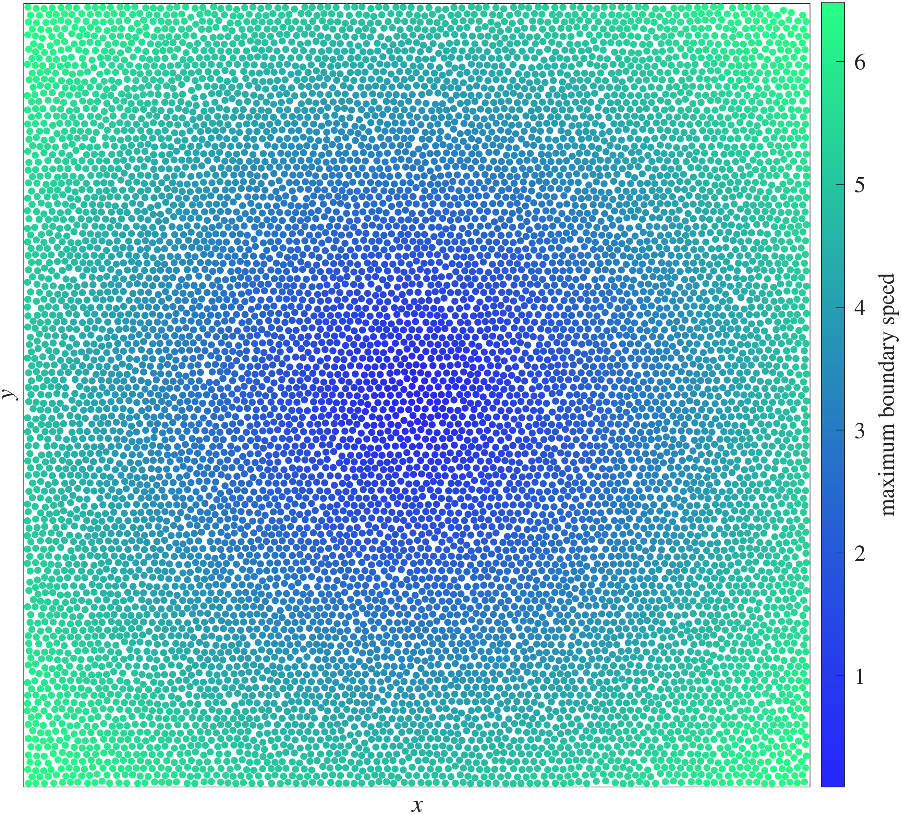
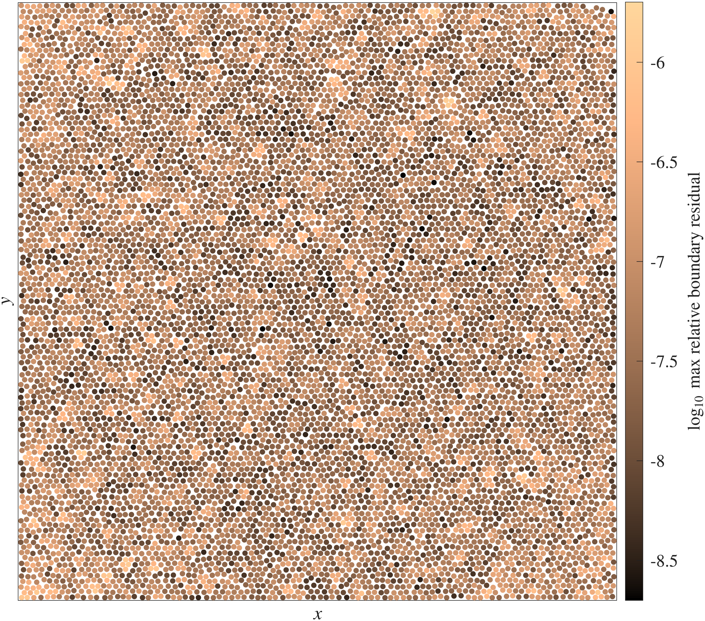
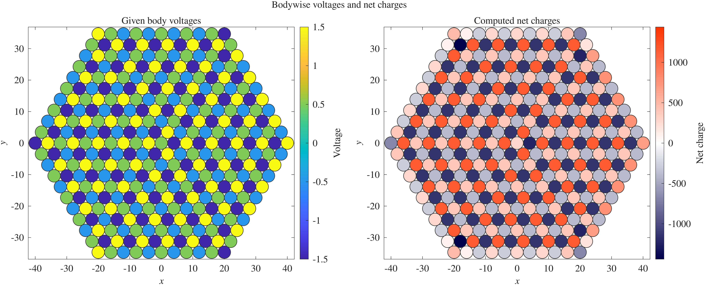

# StokesMFS2D
Method-of-fundamental-solutions (MFS) solvers for 2D Stokes and Laplace boundary value problems on geometries of close-to-touching disks in free space. This research code implements both one-body (1B) and pair-based (2B) preconditioning strategies.

The 1B solvers use left- or right-preconditioning based on single-body solves. The 2B solvers extend the right preconditioners by incorporating pair corrections. These generalise an idea of Cheng and Greengard[^cheng-greengard] and use a fine set of sources for each pair of disks. Solvers with the _peanut extension compress this two-body discretisation to an equivalent coarse set of proxy nodes within each body. With pair corrections, both the number of GMRES unknowns and the number of iterations are significantly reduced compared to one-body preconditioning.

Throughout, 1B serves as a baseline preconditioner, while 2B and peanut variants progressively incorporate near-pair interactions and their compression.

Greater gains are achieved for Stokes BVPs than for Laplace, owing to the stronger singularities in close-to-touching geometries.

  
  

<em>Example mobility problem on 10000 circles, packing fraction phi = 0.65</em>

## Repository overview
- `mobility/`
  Stokes mobility solvers (input force/torque, output rigid-body velocities), including:
  `solve_mob_1B_enhanced`, `solve_mob_2B_enhanced`, `solve_mob_peanut_enhanced`
  (1B: one-body preconditioning; 2B: pair corrections; peanut: compressed 2B).
- `resistance/`
  Stokes resistance solvers (input rigid-body velocities, output force/torque), including:
  `solve_res_1B_enhanced`, `solve_res_2B_enhanced`, `solve_res_peanut_enhanced`
  (1B: one-body preconditioning; 2B: pair corrections; peanut: compressed 2B).
- `laplace/`
  Scalar Laplace solvers for capacitance and elastance problems, where the capacitance formulation corresponds to a modified BVP.[^stein-barnett-2022]
  - Capacitance (`solve_cap_1B`, `solve_cap_2B`, `solve_cap_peanut`):
    prescribe per-body voltages `v_body`, solve for per-body net charges `Q_body`.
  - Elastance (`solve_elast_1B`, `solve_elast_2B`, `solve_elast_peanut`):
    prescribe per-body net charges `Q_body`, solve for per-body voltages `v_body`.
  - In the Laplace solvers, `opt.rad ~= 1` is used to avoid the unit
    logarithmic-capacity case in 2D.
- `geometry/`
  Grid generation and close-pair enhancement tools.
- `common/`
  Shared kernels for resistance and mobility: basis assembly, transformations, and helper utilities.
- `gmres/`
  GMRES utilities.
- `demo/`
  Practical comparison scripts and usage examples, with two primary entry points:
  - `test_mob_res.m`: compares Stokes mobility/resistance solver families (1B, 2B, peanut), including two-way checks.
  - `test_cap_elast.m`: compares Laplace capacitance/elastance solver families (1B, 2B, peanut), including two-way checks.
- `experiments/`
  Some research experiments, e.g. on long-range preconditioning.
- `tools/`
  Plotting and helper routines.

## Self tests
Most core solver/operator functions contain a built-in self test.  
Run the function with no input arguments, for example:
- `solve_mob_2B_enhanced()`
- `solve_res_peanut_enhanced()`
- `solve_cap_2B()`
- `solve_elast_peanut()`

## Highlighted demos

### Solver overview

- `demo/test_mob_res.m`
  - Compares Stokeslet-only enhanced solvers with pair corrections:
    `solve_mob_2B_enhanced`, `solve_mob_peanut_enhanced`,
    `solve_res_2B_enhanced`, `solve_res_peanut_enhanced`.
  - Optional comparison against one-body (1B) solvers with left/right preconditioning
    (currently: `solve_mob_1B`, `solve_res_1B`, based on mixed source types).
  - Supports line, dumbbell, cluster, and hexagonal particle layouts.
  - Two-way check: solve the mobility problem from `(F,T)` to obtain `(U,W)`, then solve the resistance problem using that `(U,W)` and compare the recovered `(F,T)` with the original input (and vice versa).

- `demo/test_cap_elast.m`
  - Capacitance: prescribed `v_body`, solve for net charge `Q_body`.
  - Elastance: prescribed net charge `Q_body`, solve for `v_body`.
  - Two-way check: solve the capacitance problem from `v_body` to obtain `Q_body`, then solve the elastance problem using that `Q_body` and compare the recovered `v_body` with the original input (and vice versa).

---

### Mobility/resistance and elastance/capacitance for aligned particles

- `demo/particle_line_mob.m`
  - Solves the mobility problem for \(P\) particles arranged in a line with separation \(\delta\).
  - Records relative residuals and GMRES iterations over sweeps in \(\delta\) and \(P\).
  - Optional `resistance = true` branch solves the corresponding resistance problem on the same geometries and reports results in separate figures.

- `demo/particle_line_elast.m`
  - Sweeps the same line geometry for the elastance solve.
  - Optional `capacitance = true` branch solves the corresponding capacitance problem.

  **Note:** For the capacitance branch, a larger pair-detection parameter `delta_pair` is required than in the mobility demo, so that pair corrections capture longer-range interactions (including interactions beyond nearest neighbours).

## Implementation notes
### Source-types 
- The `dev_image_based/` folders under `mobility/`, `resistance/`, and `common/` contain older and less polished helper functions for Stokes close-interaction resolution based on multiple source types.
- Outside these `dev_image_based/` paths, the Stokes solvers used in the main comparisons are Stokeslet-only.

### Precomputations
For each close pair, the peanut compression can be represented as a dense correction matrix that maps coarse source strengths to corrected coarse source strengths for that pair. At the many-body level, these pairwise maps are not applied one pair at a time, but are assembled as blocks of a large sparse correction matrix over the full system. This makes the matrix-vector products predominantly FMM-dominated, often accounting for more than 90% of the solve time depending on the packing fraction. For visual illustrations of these assembled sparse operators, run `mobility/buildMobPeanutBigSparseStokes.m` and `resistance/buildResPeanutBigSparseStokes.m` with no input arguments.

Setup also constructs coarse-to-body-quantity mapping operators. These enable efficient recovery of physical quantities such as forces and torques (resistance problems), velocities (mobility problems), charges (capacitance problems), and voltages (elastance problems) directly from the compressed representation, without reconstructing the fine source strengths.

With these mappings in place, fine sources are only reconstructed when the solution field is evaluated at or near the particle boundaries.

#### Shared compressions
For pairs that share the same separation, a shared-rotation path is under development. In this experimental path, a canonical pair problem is solved once for each unique inter-particle distance. For any physical pair at that separation, the corresponding source-strength vector is interpolated via FFT to the canonical configuration, the pair solution is evaluated there, and the corrected coarse source strengths are then rotated back to the physical pair frame.

**Note:** A remaining task for the shared-rotation path is to assess how interpolation error affects the overall accuracy, and in particular whether the accuracy depends on the rotation.

##### Capacitance on a hexagonal grid

The figure shows prescribed body voltages and the corresponding net charges recovered by a peanut-compressed capacitance solve on a 331-disk hexagonal geometry with 930 near-contact pairs at separation $10^{-3}$.

GMRES converges to a tolerance of $10^{-8}$ in 95 iterations. The relative boundary residual on independent check nodes is $1.4\times 10^{-7}$. The solve uses 72 boundary unknowns and 60 interior source points per body, with a combined setup and solve time of 10.4 seconds on a Lenovo ThinkPad P14s Gen 5 AMD laptop (AMD Ryzen 7 PRO 8840HS). The corresponding capacitance-to-elastance two-way error in the recovered voltages is $3.8\times 10^{-7}$.

For comparison, a 1B preconditioned solve using the same fine discretisation requires 21,728 unknowns on a smaller 61-disk geometry (the four inner rings of the lattice), compared with 19,512 unknowns for the larger peanut-compressed example. With GMRES tolerance $10^{-8}$, the 1B solve requires 376 iterations and stalls at a relative boundary residual of $6.0\times 10^{-3}$.

Reproduce this example with `demo/capacitance_on_hexagonal_pack.m`, which also visualises additional diagnostics.

## Dependencies
- [fmm2d](https://github.com/flatironinstitute/fmm2d) for fast 2D kernel summation.
- [memorygraph](https://github.com/ahbarnett/memorygraph) for RAM estimation when `opt.RAM_check = true`.

### References in footnotes
[^cheng-greengard]:
  Cheng, H., and Greengard, L. (1998). *A method of images for the evaluation of electrostatic fields in systems of closely spaced conducting cylinders.* SIAM Journal on Applied Mathematics.

[^stein-barnett-2022]:
  Stein, D. B., and Barnett, A. H. (2022). *Quadrature by fundamental solutions: kernel-independent layer potential evaluation for large collections of simple objects.* Advances in Computational Mathematics (ACOM). The capacitance formulation here follows the lemma introducing the modified Laplace exterior 2D BVP.
