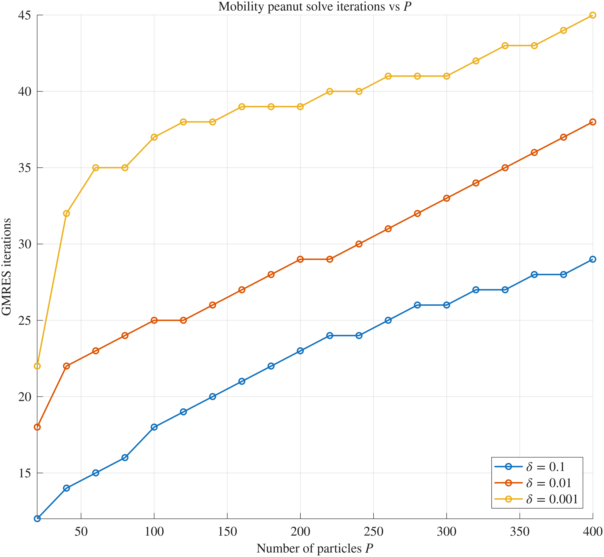
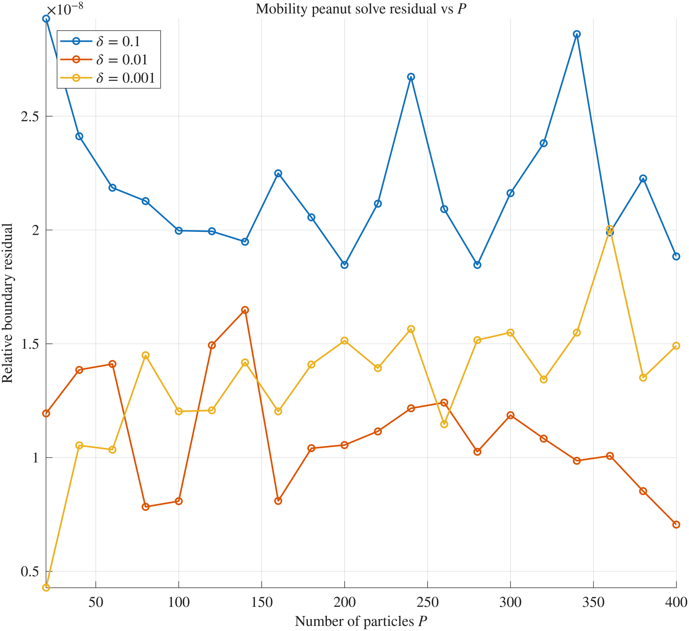
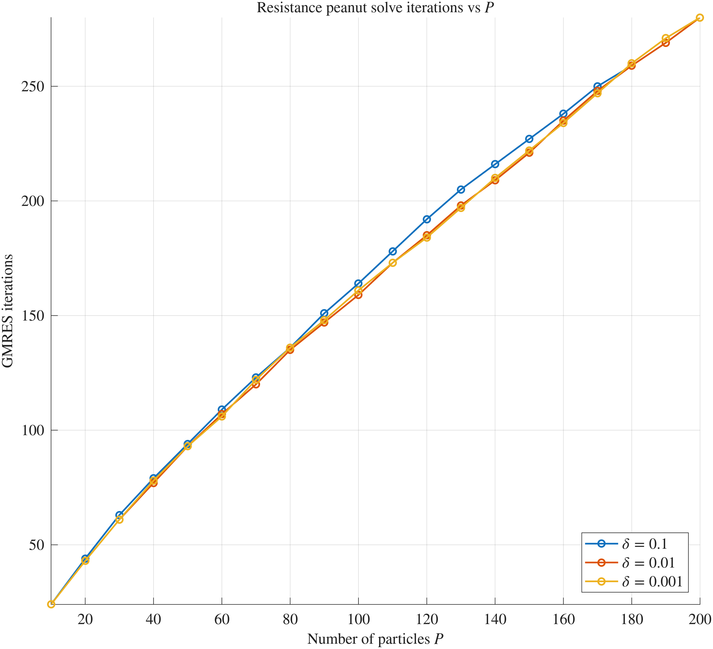
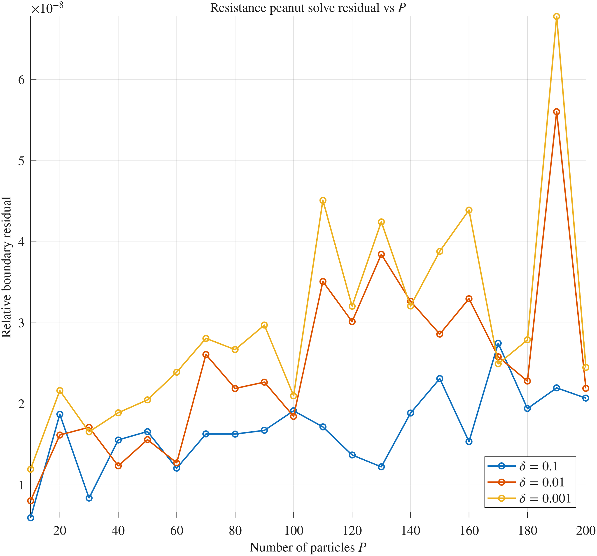
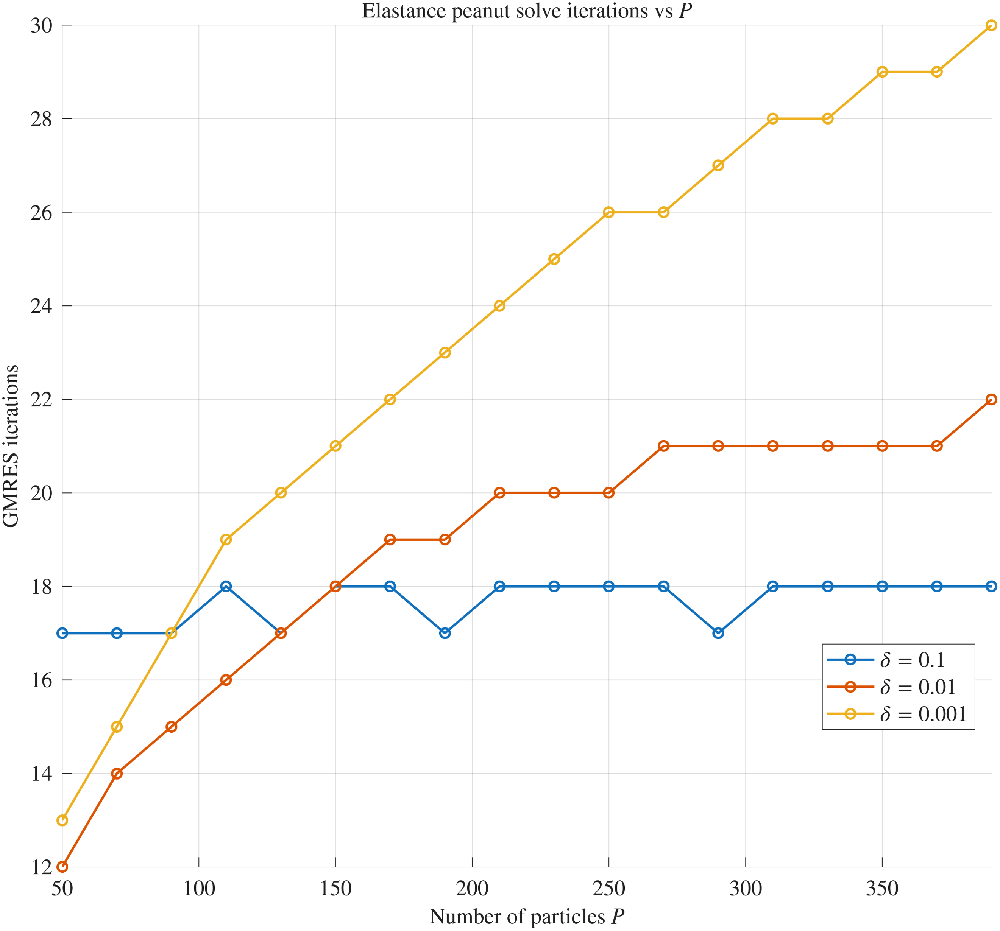
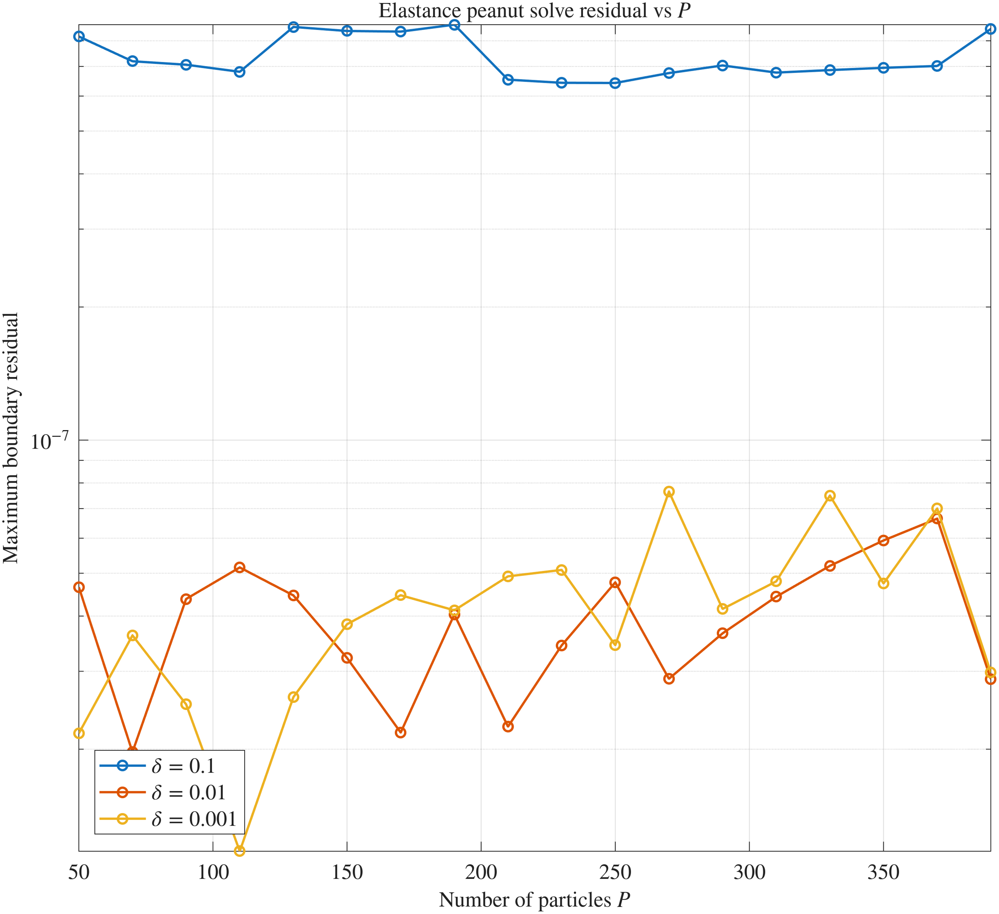
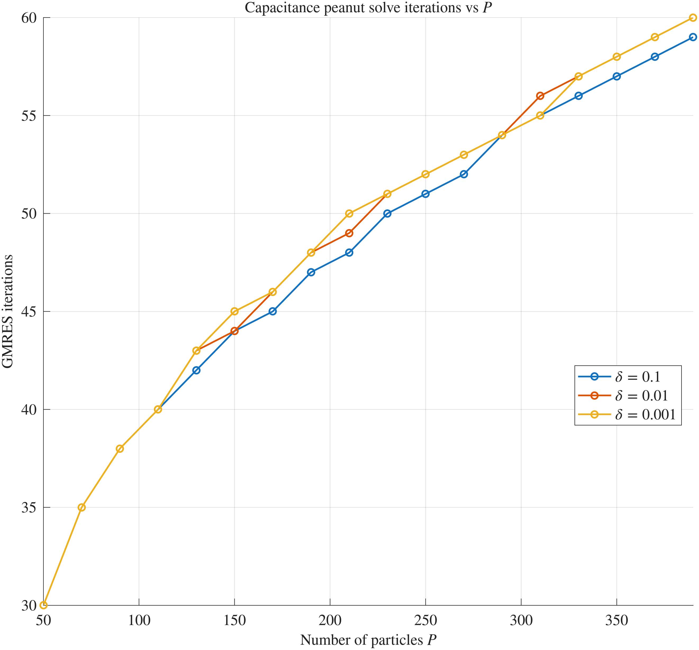
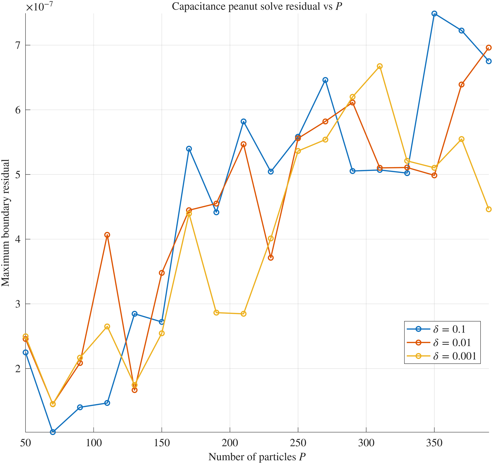

## Aligned particle experiments
Investigates iteration counts and boundary residuals for 
P particles in a line.

Reproduce using particle_line_mob.m and particle_line_elast.m.
### Mobility / Resistance

  
  

Mobility. Left: iterations. Right: relative residual.

  
  

Resistance. Left: iterations. Right: relative residual.
Long-range effects are dominant.

---

### Elastance / Capacitance

  
  

Elastance. Left: iterations. Right: relative residual.

  
  

Capacitance. Left: iterations. Right: relative residual.
Compare with resistance. Long-range effects are dominant.

**Note:**
- A higher resolution is used for Stokes than for Laplace, leading to the lower residuals.
- A larger pair-detection parameter `delta_pair` is needed for capacitance. With this choice, each particle is considered in a pair not only with its nearest neighbours, but also with particles beyond them. This does not appear to be necessary for capacitance problems on a hexagonal packing. Why?