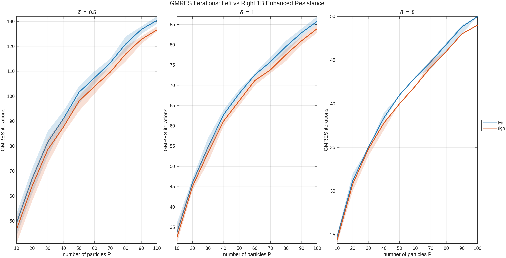
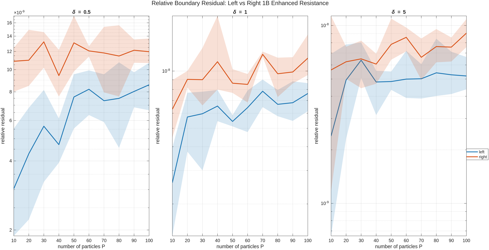
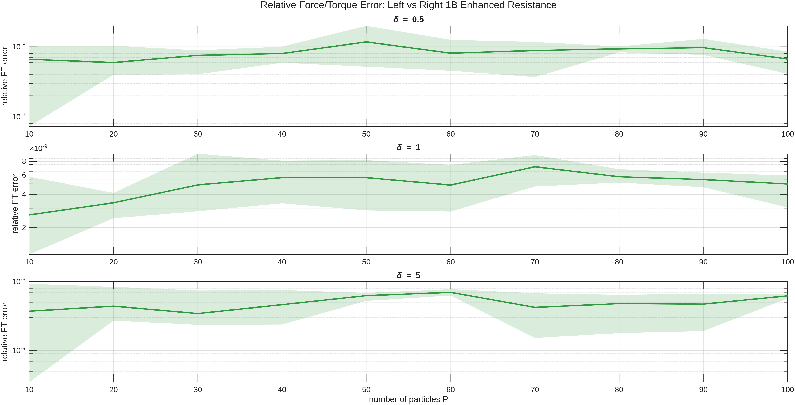

## Left vs Right 1-Body Preconditioning (Resistance)

The results of the demo left_right_precond.m:

The 2D Stokes resistance problem is solved on randomized clusters of 
P disks with separation parameter delta. Left and right 1-body preconditioning, using the same discretisation, are compared in terms of GMRES iterations, relative boundary residuals, and force/torque mismatch.

    

    

    

